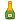
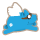
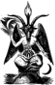
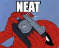
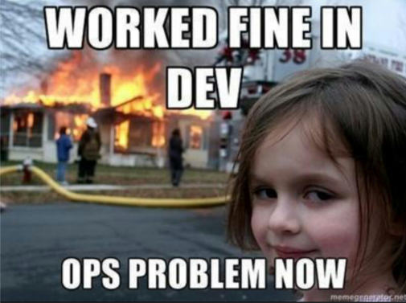
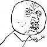

# Emoticons
Cisco Jabber default emoticon stickers and some custom additions

| @1x	| @2x	| @3x	|
| ---	| ---	| ---	| 
| 	| 	| 	|
| 	| 	| 	|
| 	| 	| 	|
| 	| 	| 	|
| 	| 	| 	|
| 	| 	| 	|
| 	| 	| 	|
| 	| 	| 	|
| 	| 	| 	|
| 	| 	| 	|
| 	| 	| 	|
| 	| 	| 	|
| 	| 	| 	|
| 	| 	| 	|
| 	| 	| 	|
| 	| 	| 	|
| 	| 	| 	|
| 	| 	| 	|
| 	| 	| 	|
| 	| 	| 	|
| 	| 	| 	|
| 	| 	| 	|
| 	| 	| 	|
| 	| 	| 	|
| 	| 	| 	|
| 	| 	| 	|
| 	| 	| 	|
| 	| 	| 	|
| 	| 	| 	|
| 	| 	| 	|
| 	|  	| *missing*
| 	| 	| 	|
| 	| 	| 	|
| 	| 	| 	|
| 	| 	| 	|
| 	| 	| 	|
| 	| 	| 	|
| 	| 	| 	|
| 	| 	| 	|
| 	| 	| 	|
| 	| 	| 	|
| 	| 	| 	|
| 	| 	| 	|
| 	| 	| 	|
| 	| 	| 	|
| 	| 	| 	|
| 	| 	| 	|
| 	| 	| 	|
| 	| 	| 	|
| 	| 	| 	|
| 	| 	| 	|
| 	| 	| 	|
| 	| 	| 	|
| 	| 	| 	|
| 	| 	| 	|
| 	| 	| 	|
| 	| 	| 	|
| 	| 	| 	|
| 	| 	| 	|
| 	| 	| 	|
| 	| 	| 	|
| 	| 	| 	|
| 	| 	| 	|
| 	| 	| 	|
| 	| 	| 	|
| 	| 	| 	|
| 	| 	| 	|
| 	| 	| 	|
| 	| 	| 	|
| 	| 	| 	|
| 	| 	| 	|
| 	| 	| 	|
| 	| 	| 	|
| 	| 	| 	|
| 	| 	| 	|
| 	| 	| 	|
| 	| 	| 	|

| Single-Scale	|
| ---	|
|  |
| 	|
| 	|
| 	|
| 	|
| 	|
| 	|
| 	|
